  <h1>Hi there, I'm Abdullah 👋</h1>
  

 

<table width="100%" border="0" align="center">
  <tr>
    <td width="60%" valign="top">
      <h3>🚀 About Me</h3>
      <ul>
        <li>🔭 Building scalable semester projects for <b>Operating Systems, Database Systems, and AI</b>.</li>
        <li>🌱 Deepening knowledge in <b>AI, Machine Learning</b>, and core <b>Computer Science</b>.</li>
        <li>👁️ Hands-on experience in <b>Computer Vision</b> (Semantic & Instance Segmentation using U-Net, SegFormer, DeepLab, YOLOv8).</li>
        <li>💻 Daily driver is <b>macOS</b>; bridging low-level system mechanics with high-level ML models.</li>
        <li>🤝 Using tech for social good and community development.</li>
      </ul>
    </td>
    <td width="40%" valign="top" align="center">
      <h3>📈 GitHub Stats</h3>
      
        
      
    </td>
  </tr>
</table>

 

<h3 align="center">🛠️ Tech Stack & Tools</h3>

  
  
  
  
  
  
  
  

 

<h3>🔥 Featured Projects</h3>
<table width="100%" border="0">
  <tr>
    <td width="50%" valign="top">
      <h4>🌍 <a href="https://github.com/Abdullah-AYP/Humanitarian-Aid-Distribution-System">Humanitarian Aid System (Gaza)</a></h4>
      
Complex logistical routing optimizing aid delivery. Implements advanced Data Structures (AVL Trees, Heaps, Graphs) for resource allocation.

    </td>
    <td width="50%" valign="top">
      <h4>🚀 <a href="https://github.com/Abdullah-AYP/CV_HACKATHON_AIRLINES">Space Station Safety Detector</a></h4>
      
AI-driven Computer Vision hackathon project focusing on <b>Instance Segmentation</b>. Utilizes <b>YOLOv8</b> for real-time safety equipment classification.

    </td>
  </tr>
  <tr>
    <td width="50%" valign="top">
      <h4>🗺️ <a href="https://github.com/Abdullah-AYP/ML-DATATHON">Terrain Semantic Segmentation</a></h4>
      
Machine learning hackathon project for pixel-level landscape classification using advanced architectures like <b>U-Net</b> and <b>SegFormer</b>.

    </td>
    <td width="50%" valign="top" align="center">
      <h4>🏆 Top Languages</h4>
      
    </td>
  </tr>
</table>

  <h3>🐍 My Coding Activity</h3>
  <picture>
    <source media="(prefers-color-scheme: dark)" srcset="https://raw.githubusercontent.com/Abdullah-AYP/Abdullah-AYP/output/github-contribution-grid-snake-dark.svg">
    <source media="(prefers-color-scheme: light)" srcset="https://raw.githubusercontent.com/Abdullah-AYP/Abdullah-AYP/output/github-contribution-grid-snake.svg">
    
  </picture>

